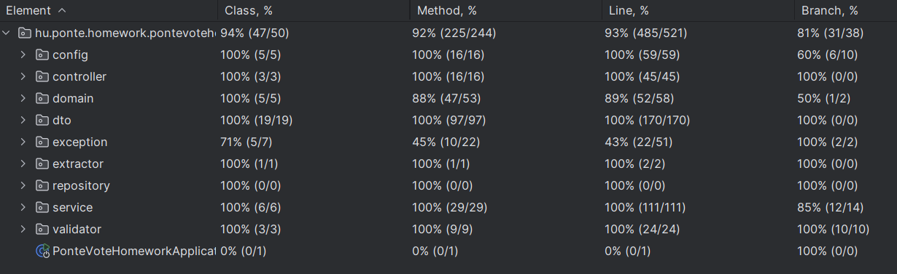

Api dokuemntáció: https://app.swaggerhub.com/apis/TAMASDURO_1/ponte-vote_api-homeWork/1.0.0

A fentebbi linket kimásolva és beilletszve a címsorba,
elfog irányítani a https://app.swaggerhub.com oldalára,
ahol meglehet tekinteni az api végpontok dokumentációját.

Adatbázis kapcsolat:

    url: jdbc:postgresql://localhost:5432/pontehw
    username: ponte
    password: ponte123

Ez ugye benne van a yaml fájlban de leírom, hogy innen is hozzáférhető legyen.

A feladatban foglalatakhoz mérten az admin belépési email és jelszó: [admin/admin]

Bejelentkezés után egy tokent fog visszaadni a rendszer Postmanen keresztül

pl ilyet: [eyJhbGciOiJIUzI1NiJ9.
eyJyb2xlIjoiVVNFUiIsInN1YiI6Im1haWxAbWFpbC5jb20iLCJpYXQiOjE3MzY1NjgxNDEsImV4cCI6MTczNjU2OTU4MX0
.ivjJmWn2o7TZSpJlHEMYiazSMTtI4oBdpxTP2S6AUd0]

Ez a token 24 percig él és utána újra be kell jelentkezni. 

Postmanben lehet az a leggyorsabb, ha rákattintunk az Authorization fülre Auth Type 
legördülő fülön kiválasztjuk a Bearer Token lehetőséget és oda bemásoljuk a Token mezőbe a tokent.

Vagy betesszük Authoziation Bearer + token a headerbe.

A program ezt a header vizsgálja, hogy van-e token és aszerint validálja a felhasználót amilyen szerepköre van.

Ha már van token, akkor role alapján különböző végpontokat érhetünk el.
Próbáltam mennél jobban csoportosítani őket szerepkörök szerinte totálisan elkülönítve.

mindenki eléri: http://localhost:8080/api/auth 

admin végpontok: http://localhost:8080/api/admin

sima user végpontok: http://localhost:8080/api/idea

Ezáltal a feladatban leírtakhoz, hogy admin ne szavazhasson már az első lépésnél meghiúsul.

A program indtása után Flyway segítségével az admin bekerül az adatbázisba így instant be is 
lehet lépni tetszés szerint.

Készítettem Postmanben minden végponthoz http methodot, ezt majd
megfogom osztani azzal az email címmel amelyről 
a feladatot kaptam és nem kell kézzel külön megírni őket. 
Maximum a body illetve a pathvariable tartalmát kell majd megadni.
 
Írtam néhány tesztet is, leginkább a service és controller classok kerültek fókuszba
a coveraget a tesztek elindítás után vagy a  lehet elérni amely
